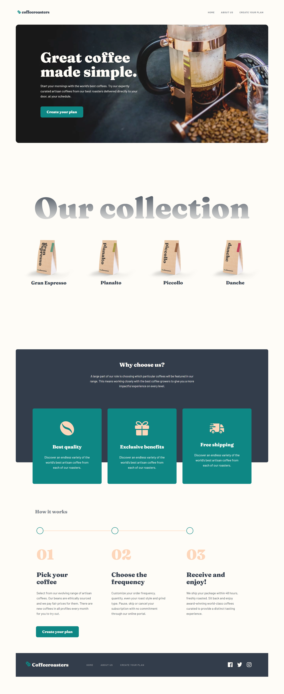

# Coffeeroasters

## Table of contents

- [Overview](#overview)
  - [The challenge](#the-challenge)
  - [Screenshot](#screenshot)
  - [Links](#links)
- [My process](#my-process)
  - [Built with](#built-with)
  - [What I learned](#what-i-learned)
  - [Continued development](#continued-development)
- [Author](#author)

## Overview

### The challenge

Users should be able to:

- View the optimal layout for each page depending on their device's screen size
- See hover states for all interactive elements throughout the site
- Make selections to create a coffee subscription and see an order summary modal of their choices

### Screenshot



### Links

- Live Site URL: [Coffeeroasters](https://coffeeroasters.gatsbyjs.io/)

## My process

### Built with

- Semantic HTML5 markup
- CSS custom properties
- Flexbox
- Mobile-first workflow
- [Gatsby.js](https://www.gatsbyjs.com) - React framework
- [Styled Components](https://styled-components.com/) - For styles
- [Framer Motion](https://www.framer.com/docs/animation/)

### What I learned

I decided to use a Gatsby framework to create this website. This framework requires more advanced knowledge of data handling when compared to a NextJS or pure a React framework.

Gatsby relies heavily on GraphQL and plugins to manage data and content. The data can be extracted to page queries for routes or static query hooks to to read data into components.

Gatsby is great for image optimization and can convert an image to a modern format before first page load vastly improving performance.

In order to handle most of the JavaScript for placing an order and providing the summary, I had tried a few different methods starting with reducers and React Context. Data management was a bit tricky until I found a useful hook for data management.

The useBetween hook allows you to manage state between scattered React component props. I took this hook and was able to create useSummary hook to cut down on a lot of the code required.

You can look up my useSummary hook in the hooks folder if you want to see the full implementation, but here is a bit of the code where most of the magic happens:

```js
const [{ group1, group2, group3, group4, group5 }, setActive] =
  useState(initialState)

const [disable, setDisable] = useState(true)
const [accordion, setAccordion] = useState(false)

const handleChange = e => {
  const { name, value } = e.target
  setActive(prevState => ({ ...prevState, [name]: value }))

  if (group1 && group2 && group3 && group4 && group5 !== "") {
    setDisable(false)
  } else if (accordion !== false && group2 && group3 && group5 !== "") {
    setDisable(false)
  } else {
    setDisable(true)
  }
}
```

Basically there are 5 accordions available and this handleChange method keeps track of which radiobutton inside each accordion has been pressed. After figuring out that logic, it makes it possible to pass the state to other prop components to disable buttons or pass form information to the OrderModal.

### Continued development

This project took a bit longer than expected to complete due to finding an ideal state management tool to stick with and learning GraphQL. I think I may begin my next project with identifying what my goal is in terms of data managment to speed up development.

## Author

- Website - [Jason Nembhard](https://www.jasonnembhard.com)
